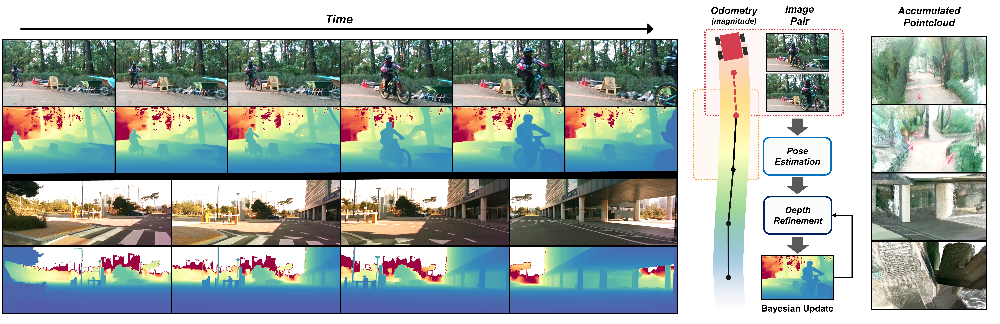
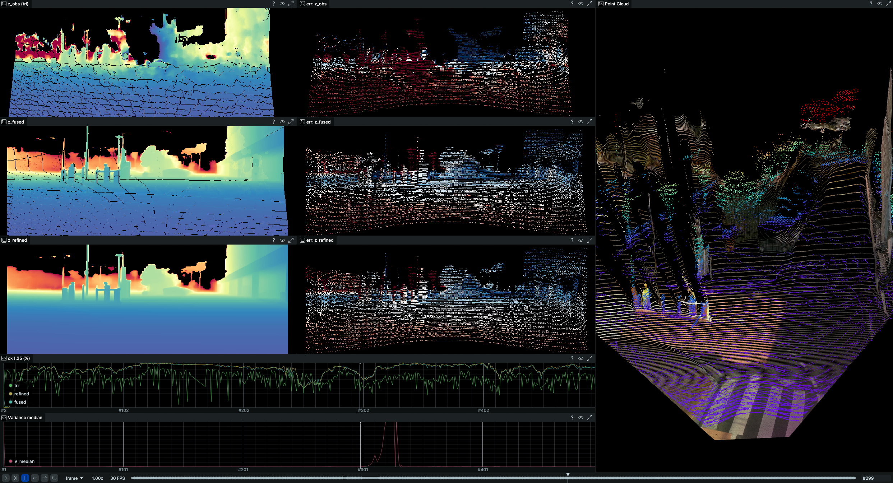

# PTC-Depth

[](https://arxiv.org/abs/2604.01791) [](https://ptc-depth.github.io/)

This is the official implementation of "PTC-Depth: Pose-Refined Monocular Depth Estimation with Temporal Consistency" (CVPR 2026). 

PTC-Depth produces **temporally consistent metric depth from monocular image sequences using only wheel odometry (or GPS, IMU, etc.)** — no LiDAR, no training. Works across RGB, NIR, and thermal imagery.



## News
- **2026-04**: Roadside thermal and forest sample data added
- **2026-04**: Code and sample data released

## Installation

> **Note:** The runtimes reported in the paper were measured with optical flow and segmentation running in parallel via C++ multithreading. This release does not include the multithreaded segmentation module due to external dependencies — segmentation is instead provided as a Python example (`ptc_depth.segmentation`).

We recommend installing into an isolated Python 3.8+ environment (venv or conda) to avoid dependency conflicts:

```bash
# venv
python -m venv .venv && source .venv/bin/activate

# or conda
conda create -n ptc-depth python=3.10 -y && conda activate ptc-depth
```

**System dependencies**

```bash
sudo apt install libopencv-dev libeigen3-dev cmake
```

**Library install (for use in your own code)**

```bash
pip install git+https://github.com/ajou-arrl/ptc-depth.git
```

**Demo install (to run the `examples/` scripts)**

The demo scripts (`download_sample.py`, `visualize_sample.py`) are not shipped inside the wheel, so you need to clone the repository and install with the `demo` extra:

```bash
git clone https://github.com/ajou-arrl/ptc-depth.git
cd ptc-depth
pip install -e ".[demo]"
```

The `demo` extra adds `matplotlib`, `rerun-sdk`, and `pyyaml`, which are only used by the example scripts.

## Sample Data

We provide 500-frame subsets from our self-collected Wheel dataset (roadside RGB, roadside thermal, forest RGB) for demo purposes. Each dataset includes images, pre-computed inverse depth maps, GT LiDAR depth, and per-frame baselines derived from wheel odometry.

```bash
python examples/download_sample.py
python examples/visualize_sample.py --dataset roadside
python examples/visualize_sample.py --dataset roadside_thr
python examples/visualize_sample.py --dataset forest
```



The visualization includes:

- **z_obs** (triangulated depth): The raw observation used for fusion. Shows how accurate the per-frame triangulation is before temporal accumulation.
- **z_refined** (final output): The Bayesian fused result over time. Shows how depth accuracy stabilizes as scale estimates accumulate across frames.
- **median variance**: Median of Bayesian posterior variance over time. Represents the pipeline's overall confidence in the current depth estimate, combining accumulated prior uncertainty with current observation quality. Note that this reflects geometric confidence, not metric depth accuracy.

## Usage

`inv_depth` takes the raw output of a monocular depth model — no additional preprocessing required. We used [Depth Anything V2](https://github.com/DepthAnything/Depth-Anything-V2) (ViT-L) in our experiments. Other relative depth models may work but have not been tested.

```python
from ptc_depth import PTCDepth

pipeline = PTCDepth(H=480, W=640, fx=500, fy=500, cx=320, cy=240)

for img, inv_depth, baseline in sequence:
    result = pipeline(img, inv_depth, baseline)
    depth = result['depth']       # (H, W) metric depth
    variance = result['variance'] # (H, W) uncertainty
```

**With segmentation**

The paper reports results with segmentation enabled by default. In this release, segmentation is optional and provided as a Python module. To use it, install `scikit-image` and pass `seg_labels` to the pipeline:

```python
from ptc_depth.segmentation import EdgeAwareSegmentation

segmenter = EdgeAwareSegmentation()
labels = segmenter.segment(image, rel_depth, sky_mask)
result = pipeline(image, inv_depth, baseline, seg_labels=labels)
```

**Verbose output**

The pose is an intermediate result of the pipeline, not a standalone pose estimator. It may be imprecise in some frames, but such cases are filtered out during the Bayesian fusion step.

```python
pipeline = PTCDepth(..., verbose=True)
result = pipeline(image, inv_depth, baseline)
# result['pose']    — (4, 4) SE(3) relative pose
# result['z_obs']   — triangulated depth
# result['z_fused'] — Bayesian fused depth (before per-label scale)
```

**External pose and flow**

You can provide an external rotation matrix and/or translation vector to bypass the internal motion estimation. The pose follows the point-transform convention: `p_curr = R @ p_prev + t`.

| Input | Behavior |
|-------|----------|
| `external_R` + `external_t` | Skip motion estimation entirely, use provided pose for triangulation |
| `external_R` only | Fix rotation, estimate translation from optical flow |
| Neither | Estimate full pose from optical flow (default) |

`external_t` requires `external_R` — providing `external_t` alone has no effect. You can also pass pre-computed optical flow via the `flow` parameter `(H, W, 2) float32` to skip internal DIS computation.

```python
result = pipeline(image, inv_depth, baseline,
                  external_R=R,       # (3, 3) float64
                  external_t=t,       # (3,) float64
                  flow=optical_flow)  # (H, W, 2) float32, optional
```

## Configuration

See [`configs/default.yaml`](configs/default.yaml).

| Parameter | Default | Description |
|-----------|---------|-------------|
| `max_depth` | 80.0 | Maximum output depth (m) |
| `min_baseline` | 0.05 | Minimum baseline for triangulation (m) |
| `outdoor` | true | Sky detection (sky → inf) |
| `verbose` | false | Return intermediate results (pose, z_obs, z_fused) |
| `iterative` | 0 | Backward re-estimation iterations (experimental, see below) |
| `lambda_forget` | 0.1 | Prior variance inflation per frame |
| `kappa_min` | 0.25 | Minimum Kalman gain |
| `tau0_deg` | 1.0 | Variance reference angle (°) |

### Iterative Refinement (Experimental)

An extension to the pipeline proposed in the paper. The forward pass estimates motion using the monocular depth model's inverse depth, which assumes a single global scale — when the scene contains multiple depth ranges, this can lead to inaccurate initial pose estimation. Iterative refinement addresses this by computing backward optical flow and re-estimating motion using the metric-scale refined depth from the forward pass. This does not always improve accuracy, but can be beneficial when the initial pose was degraded by the single-scale assumption of the monocular depth model.

```python
pipeline = PTCDepth(..., iterative=1)
```

## Acknowledgements

This work uses [Depth Anything V2](https://github.com/DepthAnything/Depth-Anything-V2) for monocular relative depth estimation in our experiments. We thank the authors for their great work and open release.

## License

This project is released under the [BSD-3-Clause License](LICENSE). For commercial use, please contact hbeomlee@ajou.ac.kr.

## Citation

```bibtex
@article{han2026ptcdepth,
  title={PTC-Depth: Pose-Refined Monocular Depth Estimation with Temporal Consistency},
  author={Han, Leezy and Kim, Seunggyu and Shim, Dongseok and Lee, Hyeonbeom},
  journal={arXiv preprint arXiv:2604.01791},
  year={2026}
}
```
